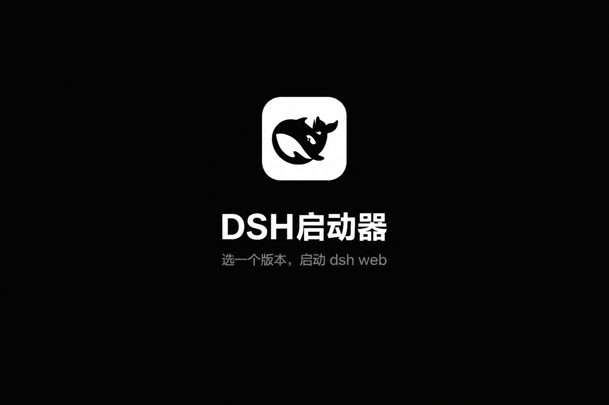
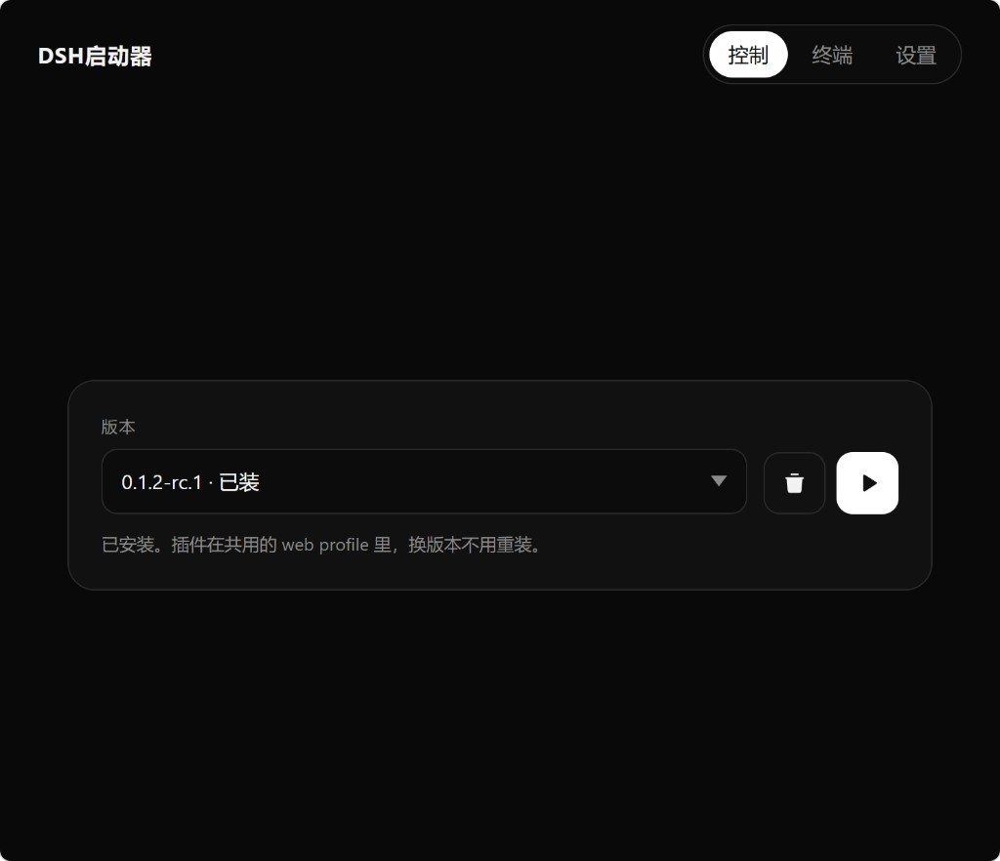
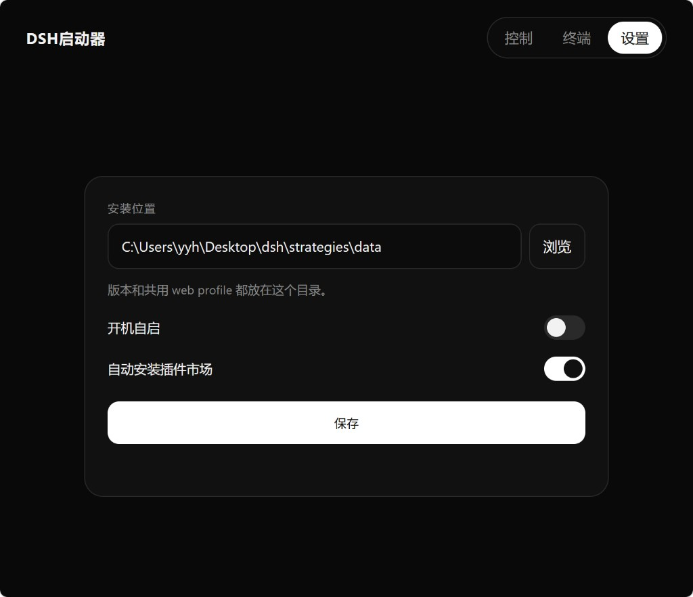

<p align="center">
  
</p>

<p align="center">
  <a href="https://yyh-001.github.io/dsh-launcher/">主页</a>
  ·
  <a href="https://github.com/yyh-001/dsh-launcher/releases/latest/download/DSH-Setup.exe">下载</a>
  ·
  <a href="https://github.com/yyh-001/dsh-launcher">Star</a>
</p>

DeepSeek Harness 轻量 Windows 启动器。选一个版本，启动 dsh web。

- **选版本即用**：启动 / 停止 / 重启 / 更新 / 卸载
- **插件页**：列出已装插件一键开关
- **兼容模式**：启动失败按报错自动禁用出问题的插件（可一键恢复）；启动后自检页面引用的客户端插件包，管理页给出结论（区分实例问题和旧标签页）
- **启动加速**：在 bundle 合成处挂等价快实现（约省 1–2 秒），dsh 升级后自动跳过
- **插件跟官方走**：数据在用户目录 `.dsh`，换版本不用重装插件
- **更新留旧版**：只保留最新的和最近装的一个（回退够用），更旧的装完自动清理
- **托盘常驻**：关网页不退出，界面走系统浏览器
- **自带 Node / npm**：安装包含便携 `node.exe` 与 npm 10，镜像源 npmmirror
- **同时只跑一个版本**：首次可预装 `dshmarket`

交流 / 反馈：**QQ 群 [993579665](https://qm.qq.com/q/7AD2g70HqS)**（[点击加入](https://qm.qq.com/q/7AD2g70HqS)）

<p align="center">
  
</p>

<p align="center">
  
</p>

## 使用

Windows 安装 [DSH-Setup.exe](https://github.com/yyh-001/dsh-launcher/releases/latest) 后，桌面打开 **DSH启动器**。管理页：`http://127.0.0.1:3780/`。

## 开发

需要本机 Node.js 22.18+（官方 DSH：`^22.19.0 || >=24`）。

```sh
npm install
npm start
```

只起网页：`npm run server`。

## 打包

需要 Rust 与 Inno Setup 6（没有会尝试下载）。

```sh
npm run dist
```

- `release/DSH/`：便携目录
- `release/DSH-Setup.exe`：安装包（默认 `%LOCALAPPDATA%\Programs\DSH`）
